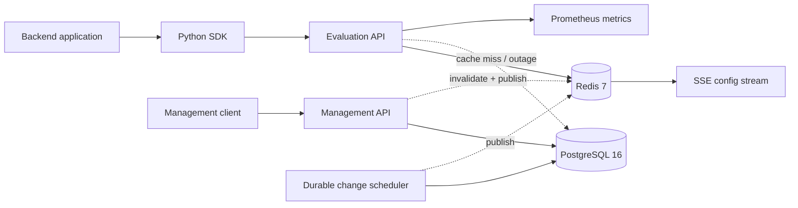

# CohortSwitch

CohortSwitch is a self-hosted feature flag and progressive rollout platform for backend applications. It combines a deterministic evaluation engine, a transactional control plane, Redis-accelerated configuration delivery, and a small async Python SDK.

## Why this project

Feature management sits at an interesting boundary: configuration writes must be strongly consistent and auditable, while evaluation reads must be fast, deterministic, and resilient to cache failure. CohortSwitch explores that boundary as an infrastructure product rather than a generic CRUD service.

## Engineering highlights

- Gradual percentage rollouts
- User and tenant targeting
- Low-latency flag evaluation
- Bucket-stable deterministic hashing
- Audit history for every change
- Hot configuration updates
- Rollback and kill-switch support
- API and Python SDK
- Metrics and rollout observability

## Architecture



PostgreSQL is the source of truth. A flag write, immutable version snapshot, environment revision increment, and audit event are committed in one transaction. Redis stores short-lived compiled configurations, rate-limit counters, and Pub/Sub fan-out; it is never authoritative.

More detail is in [docs/ARCHITECTURE.md](docs/ARCHITECTURE.md).

## Core concepts

- An organization contains projects and role-based memberships.
- A project contains independently revisioned environments.
- A feature flag has an immutable key and one configuration per environment.
- Variations carry BOOLEAN, STRING, INTEGER, or JSON values.
- Ordered targeting rules use AND conditions and return a variation or start a rollout.
- Every configuration mutation creates a linear, immutable version snapshot.
- SDK and management API keys are hashed at rest and have separate scopes.

## Feature evaluation flow

1. Authenticate the environment-scoped SDK key.
2. Load the compiled flag from Redis, falling back to PostgreSQL on a miss or Redis failure.
3. Apply the kill switch before any rule.
4. Evaluate enabled rules by ascending priority; every condition in a rule must match.
5. Return a direct variation, a deterministic rollout allocation, or the default variation.
6. Emit bounded-cardinality Prometheus metrics without subject identifiers or attributes.

The pure engine has no HTTP, database, Redis, or global mutable-state dependency. See [docs/EVALUATION.md](docs/EVALUATION.md).

## Deterministic rollout

The evaluator hashes a length-prefixed tuple of namespace, project ID, environment ID, flag key, subject key, and per-configuration salt with BLAKE2b. The first 64 bits map to a bucket from `0` through `9999`, providing 0.01% precision. Cumulative bucket boundaries make rollout growth monotonic: subjects in the first 5% remain included when the rollout grows to 10% or 20%.

## Rule engine

Rules are ordered by priority and use AND semantics. Supported operators are `equals`, `not_equals`, `in`, `not_in`, `contains`, `starts_with`, `ends_with`, `exists`, `not_exists`, numeric comparisons, and semantic-version comparisons. The first matching rule wins.

## Configuration versioning

Clients send `expected_version` with configuration writes. The service performs an atomic `UPDATE ... WHERE current_version = expected_version`; a stale writer receives `409 configuration_conflict`. A successful write replaces the normalized configuration, appends a snapshot, increments the environment revision, and writes an audit event in the same transaction.

Rollback copies an earlier snapshot into a new version. Rolling v17 back to v12 therefore creates v18 rather than moving a pointer backward.

## Cache strategy

Compiled flag configurations use short-TTL Redis keys:

```text
cohortswitch:config:{project_id}:{environment_id}:{flag_key}
```

Writers commit PostgreSQL first, then invalidate the stable cache key and publish an SSE event. If invalidation fails, the bounded TTL limits staleness. Evaluation fails over to PostgreSQL when Redis is unavailable. The consistency trade-offs are documented in [docs/ARCHITECTURE.md](docs/ARCHITECTURE.md) and [docs/RELIABILITY.md](docs/RELIABILITY.md).

## Python SDK

```python
from cohortswitch import CohortSwitchClient

async with CohortSwitchClient(
    base_url="http://localhost:8000",
    sdk_key="cs_sdk_live_...",
    cache_ttl_seconds=2,
) as client:
    enabled = await client.is_enabled(
        "new_checkout",
        subject_key="user_42",
        attributes={"country": "KZ", "plan": "PRO"},
    )
```

`evaluate()` returns a typed result. `is_enabled()` enforces a boolean value, `get_value()` returns any supported variation, and `evaluate_batch()` evaluates up to 100 flags in one request. Timeouts, network failures, and API errors become `CohortSwitchError` instances.

## API examples

Create a flag after registering, creating an organization, project, and environment:

```http
POST /api/v1/projects/{project_id}/flags
Authorization: Bearer {access_token}
Content-Type: application/json

{
  "environment_id": "00000000-0000-0000-0000-000000000000",
  "key": "new_checkout",
  "name": "New checkout",
  "description": "Enable the redesigned checkout",
  "flag_type": "BOOLEAN",
  "enabled": true,
  "default_variation": "disabled",
  "variations": [
    {"key": "enabled", "value": true},
    {"key": "disabled", "value": false}
  ],
  "rollout": [
    {"variation": "enabled", "percentage_basis_points": 500},
    {"variation": "disabled", "percentage_basis_points": 9500}
  ]
}
```

Evaluate it with the one-time SDK key returned by `POST /api/v1/sdk-keys`:

```http
POST /api/v1/evaluate
X-CohortSwitch-Key: cs_sdk_live_...
Content-Type: application/json

{
  "flag_key": "new_checkout",
  "subject_key": "user_42",
  "attributes": {"country": "KZ"}
}
```

OpenAPI is available at `/docs` after startup.

## Observability

- `GET /health/live` checks process liveness.
- `GET /health/ready` checks PostgreSQL and reports Redis loss as degraded, not unavailable, because evaluation can fall back to PostgreSQL.
- `GET /metrics` exposes HTTP latency, request totals, evaluation decisions, and cache outcomes.
- Structured JSON request logs include request ID, normalized route, status, and duration; they exclude credentials and evaluation attributes.
- Every response returns `X-Request-ID`, and sensitive changes copy it into the audit event.

## Security decisions

Passwords use Argon2. Refresh tokens are opaque, rotating, hashed at rest, and reuse revokes the remaining token family. SDK and management keys are generated with a cryptographically secure RNG, stored only as SHA-256 hashes, and shown once. Tenant checks precede resource disclosure, RBAC permissions are centralized, and SDK keys cannot call management endpoints. See [docs/SECURITY.md](docs/SECURITY.md).

## Quick start

Requirements: Docker with Compose.

```bash
cp .env.example .env
```

Replace `COHORTSWITCH_JWT_SECRET`, then run:

```bash
docker compose up --build
```

Compose waits for PostgreSQL, applies Alembic migrations, then starts the API and durable scheduler. Verify:

```bash
curl http://localhost:8000/health/ready
```

For local development with Python 3.12:

```bash
python -m venv .venv
python -m pip install -e ".[dev]" -e sdk/python
alembic -c backend/alembic.ini upgrade head
uvicorn backend.app.main:app --reload
```

## Tests

```bash
ruff check .
ruff format --check .
pytest
python -m build sdk/python
docker compose config --quiet
```

Unit coverage exercises operators, rule ordering, strict flag types, progressive stages, kill-switch priority, cross-process hashing stability, monotonic rollout growth, and a deterministic 10,000-subject distribution check. Integration coverage exercises the real PostgreSQL and Redis path, version conflicts, rollback, cache fallback, ETag, audit, API-key boundaries, SSE, and SDK calls.

## Project structure

```text
backend/app/
├── api/          HTTP transport, authentication dependencies, and schemas
├── core/         settings, security, middleware, permissions, metrics, Redis
├── database/     SQLAlchemy 2.x models and async session factory
├── evaluation/   pure operators, models, hashing, and decision engine
└── services/     transactions, compilation, cache, keys, and audit
backend/alembic/  explicit database migrations
backend/tests/    unit and integration tests
sdk/python/       independently buildable async SDK
docs/             architecture, evaluation, security, and reliability notes
```

## Design trade-offs

- Cache invalidation uses commit-then-delete plus a short TTL instead of a transactional outbox. This leaves a bounded stale window if the process dies after commit, while keeping CohortSwitch focused on evaluation correctness rather than queue infrastructure.
- Progressive stages are resolved from wall-clock time during evaluation, so planned percentage growth does not require a scheduler. Explicit scheduled mutations use a PostgreSQL-backed polling worker with row locking.
- Rate limiting uses Redis for global counters and a bounded per-process fallback during Redis failure. Availability is preserved at the cost of temporarily approximate global limits.
- SSE is intentionally non-durable. Environment revision and ETag snapshots are the recovery protocol after disconnect.
- Evaluation metrics omit subject keys and arbitrary attributes; variation and reason labels remain bounded by configuration.

## Roadmap

- Signed offline configuration bundles
- Experiment exposure export with privacy-safe sampling
- Approval policies for production changes
- Additional server-side SDKs

## License

[MIT](LICENSE)

