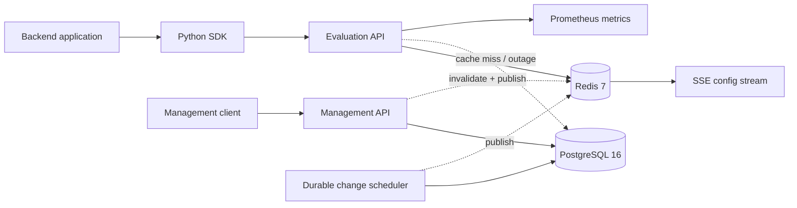

# CohortSwitch

[English](README.md) | **Русский**

CohortSwitch — self-hosted платформа feature flags и progressive rollout для backend-приложений.

Она объединяет deterministic evaluation engine, транзакционный control plane, PostgreSQL, Redis-кэш и небольшой async Python SDK.

## Зачем нужен проект

Feature management находится на границе двух требований:

- изменения конфигурации должны быть консистентными, versioned и auditable;
- чтение флагов должно быть быстрым, deterministic и продолжать работать при проблемах Redis.

CohortSwitch показывает эту задачу как инфраструктурный продукт, а не обычный CRUD.

## Основные возможности

- versioned feature flags;
- percentage rollouts;
- rollback и kill switch;
- deterministic hashing для стабильного распределения пользователей;
- targeting по organization, tenant, user и attributes;
- near-real-time config updates;
- immutable version history;
- audit log;
- PostgreSQL как source of truth;
- Redis cache + Pub/Sub;
- fallback к PostgreSQL при Redis outage;
- SDK keys и management API keys с разными scopes;
- async Python SDK;
- SSE config stream;
- Prometheus metrics;
- structured JSON logs;
- Alembic migrations;
- Docker Compose;
- unit/integration tests.

## Архитектура



Запись flag configuration, immutable snapshot, environment revision и audit event выполняются в одной PostgreSQL transaction. Redis никогда не является authoritative storage.

## Deterministic rollout

Evaluation engine хеширует namespace, project ID, environment ID, flag key, subject key и salt через BLAKE2b и получает bucket `0..9999`. Это даёт точность 0.01% и стабильное распределение: пользователь, попавший в первые 5%, остаётся включённым при росте rollout до 10% или 20%.

## Rule engine

Поддерживаются операторы:

- `equals`, `not_equals`;
- `in`, `not_in`;
- `contains`;
- `starts_with`, `ends_with`;
- `exists`, `not_exists`;
- numeric comparisons;
- semantic-version comparisons.

Правила обрабатываются по priority, внутри одного правила используется AND-semantics.

## Versioning и rollback

Клиент отправляет `expected_version`. Update выполняется атомарно только если версия совпадает. Stale writer получает `409 configuration_conflict`.

Rollback не перемещает указатель назад: например rollback v17 → v12 создаёт новую v18 на основе snapshot v12.

## Python SDK

```python
from cohortswitch import CohortSwitchClient

async with CohortSwitchClient(
    base_url="http://localhost:8000",
    sdk_key="cs_sdk_live_...",
) as client:
    enabled = await client.is_enabled(
        "new_checkout",
        subject_key="user_42",
        attributes={"country": "KZ", "plan": "PRO"},
    )
```

## Observability

- `GET /health/live` — process liveness;
- `GET /health/ready` — PostgreSQL readiness и degraded-mode при потере Redis;
- `GET /metrics` — HTTP latency, evaluations и cache outcomes;
- `X-Request-ID` на каждом response;
- audit events для чувствительных изменений.

## Безопасность

- Argon2 passwords;
- rotating opaque refresh tokens;
- token-family revocation при reuse;
- SDK и management keys генерируются через cryptographically secure RNG;
- в БД хранятся только SHA-256 hashes ключей;
- tenant checks выполняются до раскрытия ресурса;
- SDK keys не могут использовать management API.

## Быстрый запуск

```bash
cp .env.example .env
```

Заменить `COHORTSWITCH_JWT_SECRET`, затем:

```bash
docker compose up --build
```

Проверка:

```bash
curl http://localhost:8000/health/ready
```

Для локальной разработки:

```bash
python -m venv .venv
python -m pip install -e ".[dev]" -e sdk/python
alembic -c backend/alembic.ini upgrade head
uvicorn backend.app.main:app --reload
```

## Тесты

```bash
ruff check .
ruff format --check .
pytest
python -m build sdk/python
docker compose config --quiet
```

Тесты покрывают operators, rollout stability, version conflicts, rollback, Redis fallback, audit, API-key boundaries, SSE и SDK calls.

## Что демонстрирует проект

CohortSwitch показывает infrastructure/backend engineering: deterministic algorithms, consistency, caching, failure modes, multi-tenancy, security, observability и SDK design.

## License

MIT.
